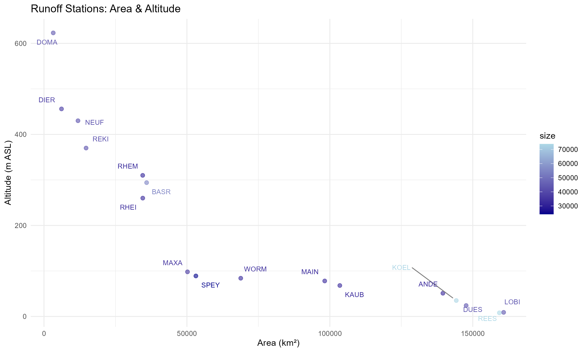
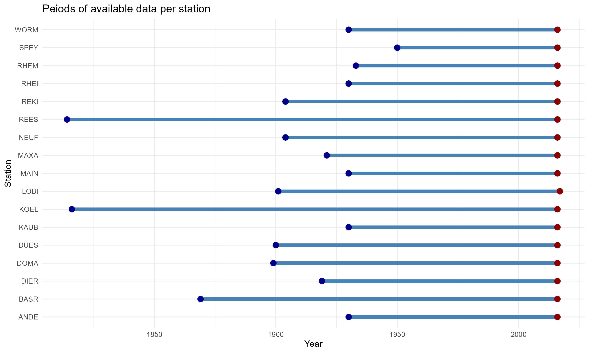
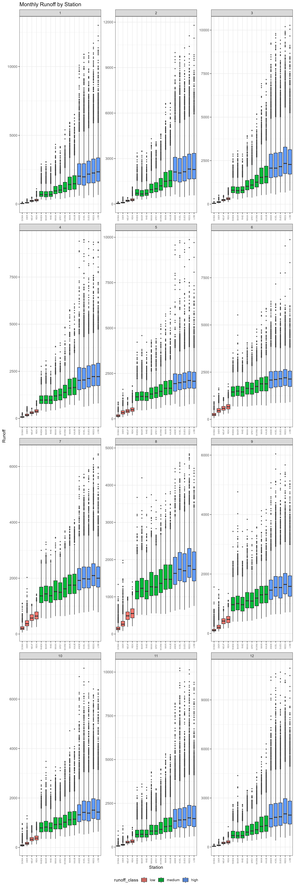
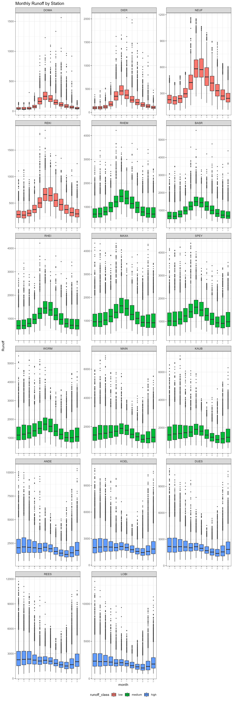
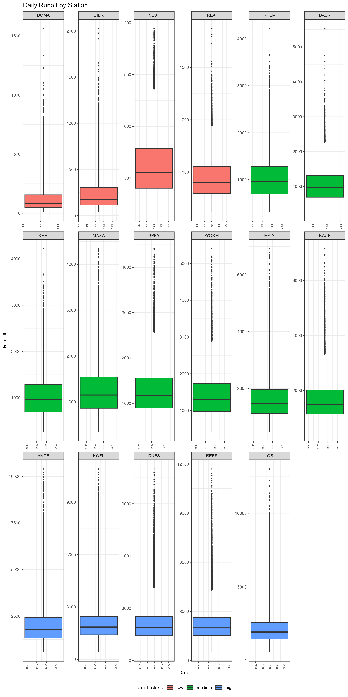
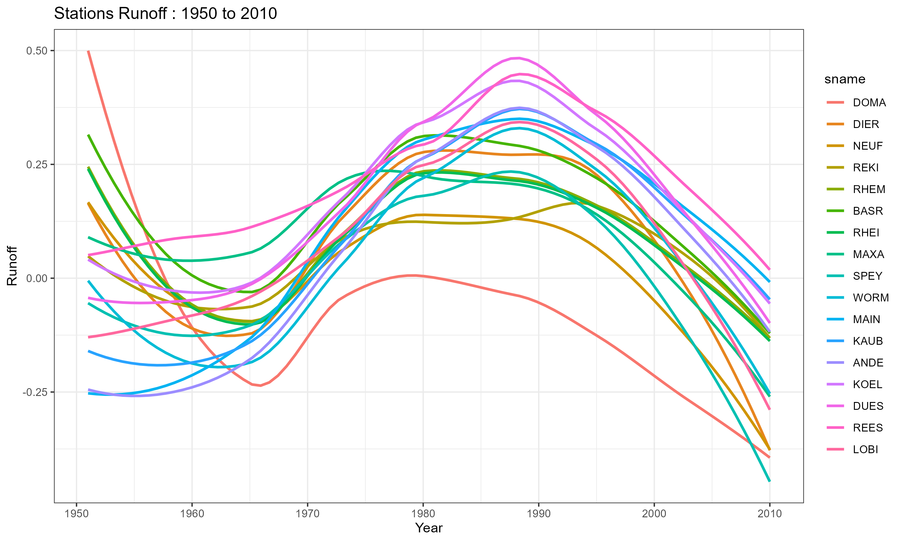
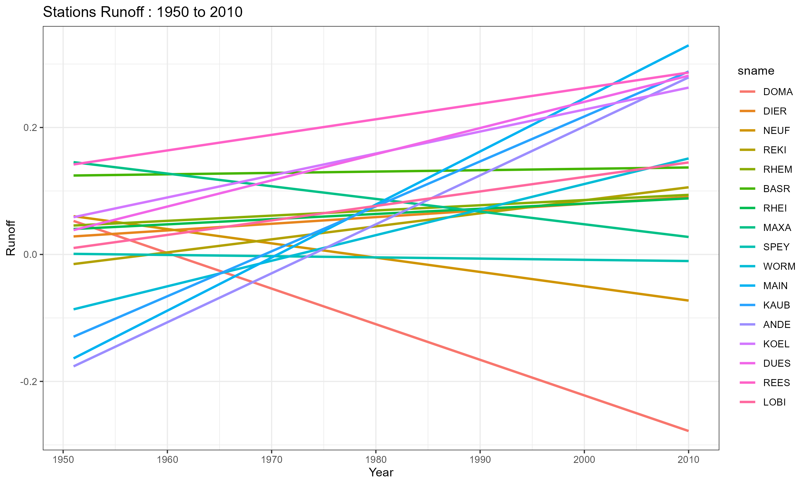
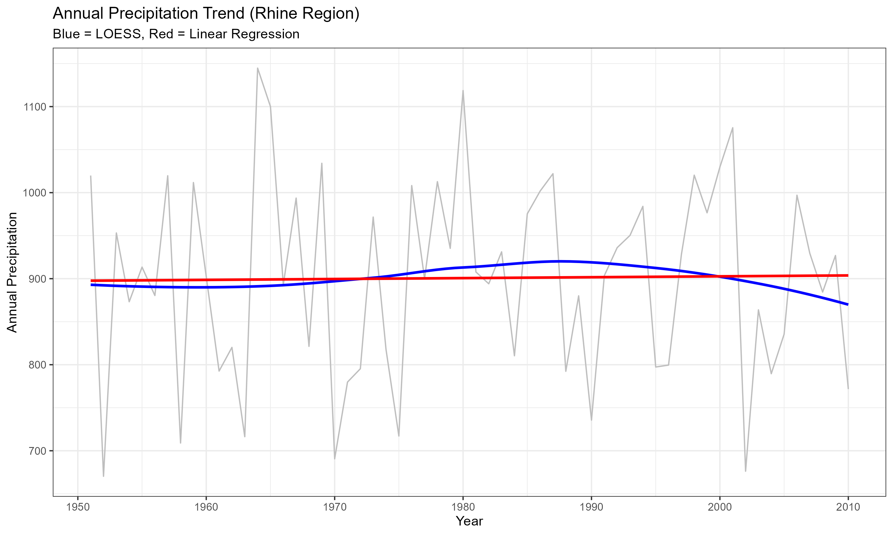

```{r setup, include=FALSE}
knitr::opts_chunk$set(echo = FALSE)
```

## The Physical Landscape: Altitude vs. Area
Exploratory data analysis (EDA) begins with the spatial distribution of the monitoring stations. Using the "data.table" library to wrangle station data, identified a strong negative correlation of -0.86 between station altitude and catchment area.

As shown in stations' area, altitude and size comparison figure, stations like DOMA are located at high altitudes but command small catchment areas. For low latitudes stations like REES and LOBI, the altitude decrease significantly while the catchment area increase.


```{r Altitude, Area and Size Comparison, fig.cap="stations' area, altitude and size comparison", fig.align='center', out.width='80%'}

```

This confirms the Rhine is a "top-down" system where the vast majority of drainage area and thus potential runoff accumulates in the lower altitude plains.


## Data Integrity: Temporal Coverage
Before analyzing trends, audited the "observation window" using Stations Data Available Period figure.

```{r Stations Data Available Period, fig.cap="Stations Data Available Period", fig.align='center', out.width='80%'}

```

The record is remarkably consistent. While start dates vary slightly, the majority of stations provide a continuous data stream from 1950 to 2016.

This high degree of overlap ensures the comparisons between Alpine upstream stations and Lowland downstream stations are temporally aligned, making the subsequent trend analysis statistically valid.


```{r Stations Available Monthly Runoff, fig.cap="Available Monthly Runoff per Station", fig.align='center', out.width='80%'}

```

## The Seasonal Analysis: Monthly Classification
By melting the data into a tidy format and applying a classification (Low, Medium, High runoff), generated the Stations' Monthly Runoff Classification figure which reveals the "dual personality" of the Rhine:

The Alpine Regime: High-altitude stations like DOMA show a distinct peak in Months 6 and 7 (June and July), likely driven by summer melt.

The Lowland Regime: Low_altitude stations like REES and LOBI exhibit higher runoff in the winter and spring months.


```{r Stations Monthly Runoff, fig.cap="Stations' Monthly Runoff Classification", fig.align='center', out.width='80%'}

```


The Outliers: In our daily boxplot analysis, Stations' Daily Runoff figure, observed that virtually all outliers are positioned above the whiskers. This suggests that the Rhine is prone to sudden, high magnitude discharge events (storms or rapid melts) rather than extreme "dry" anomalies.

```{r Daily Runoff, fig.cap="Stations' Daily Runoff", fig.align='center', out.width='80%'}

```

## Long-Term Trends: 1950–2010
For long-term trend, examined the evolution of the river's flow over a 60-year period. By comparing Linear Regression (LM) as Stations' Runoff Trend - Linear Regression Method figure and LOESS smoothing Stations' Runoff Trend - LOESS Method, can see a river in transition.
While the general trend for the basin is slightly positive (increasing runoff), DOMA acts as a significant outlier with a visible downward trajectory.

```{r Runoff trend - loess method, fig.cap="Stations' Runoff Trend - LOESS Method", fig.align='center', out.width='80%'}

```


```{r Runoff trend - lm method, fig.cap="Stations' Runoff Trend - Linear Regression Method", fig.align='center', out.width='80%'}

```


## Precipitation analysis, 
By comparing runoff trend to, precipitation trend, Precipitation Trend - LM - LOESS Method Comparison figure, it is shown that while the basin-wide rainfall remains relatively stable or slightly increasing, the specific runoff behavior at high altitude stations is diverging which can consider as the melting processes are contributing.

```{r Precipitation trend - lm - loess method, fig.cap="Precipitation Trend - LM - LOESS Method Comparison", fig.align='center', out.width='80%'}

```

## Conclusion
This exploratory data analysis suggests that the Rhine's future may not be uniform, the "alpine station - DOMA"is showing signs of decline even as the lower reaches remain well fed by regional precipitation. Global Warming is increased the snow melting processes and run out of snow to melt in future.


